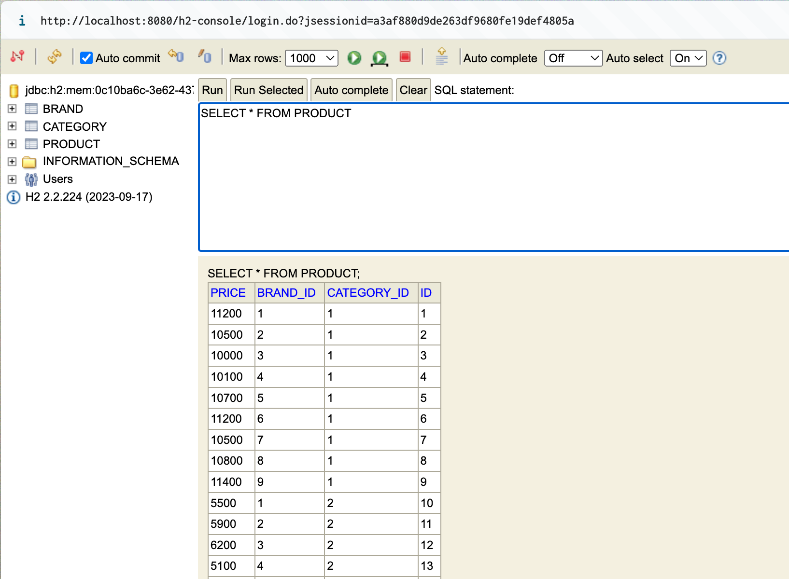

# 무신사 전시개발팀 _ Backend Engineer 사전과제
지원자 : 김예림

## 프로젝트 개요

이 프로젝트는 다음 8개의 카테고리에서 상품을 하나씩 구매하여, 코디를 완성하는 서비스의 일부입니다.
1. 상의
2. 아우터
3. 바지
4. 스니커즈
5. 가방
6. 모자
7. 양말
8. 액세서리

**카테고리별** 혹은 **브랜드별** 최저가를 조회하고, **브랜드 및 상품을 관리**하는 기능을 제공하는 **백엔드 API 서버**입니다.
고객은 카테고리별 혹은 브랜드별 최저가 및 특정 카테고리에서 최고가와 최저가 상품을 조회할 수 있으며,
운영자는 브랜드 및 상품을 추가 / 업데이트 / 삭제할 수 있습니다.

---

## 프로젝트 구조
   ```bash
├── application
│   └── display-application
│       ├── build.gradle
│       └── src
│           ├── main
│           │   ├── java
│           │   │   └── com
│           │   │       └── preassignment
│           │   │           └── musinsa
│           │   │               └── app
│           │   │                   └── service
│           │   │                       ├── brand
│           │   │                       │   └── BrandService.java
│           │   │                       └── product
│           │   │                           └── ProductService.java
│           │   └── resources
│           └── test
│               ├── java
│                   └── com
│                       └── preassignment
│                           └── musinsa
│                               └── app
│                                   └── service
│                                       ├── brand
│                                       │   └── BrandServiceTest.java
│                                       └── product
│                                           └── ProductServiceTest.java
|
├── build.gradle
├── domain
│   └── display-domain
│       ├── build.gradle
│       └── src
│           ├── main
│               ├── java
│                   └── com
│                       └── preassignment
│                           └── musinsa
│                               └── domain
│                                    ├── RootDomain.java
│                                    ├── brand
│                                   │   ├── Brand.java
│                                   │   ├── BrandCommendService.java
│                                   │   ├── dto
│                                   │   ├── request
│                                   │   │   └── BrandRequest.java
│                                   │   └── respose
│                                   │       └── BrandPriceResponse.java
│                                   ├── category
│                                   │   ├── Category.java
│                                   │   ├── dto
│                                   │   │   └── CategoryPriceRange.java
│                                   │   ├── request
│                                   │   └── response
│                                   │       └── CategoryPriceResponse.java
│                                   └── product
│                                       ├── Product.java
│                                       ├── ProductCommendService.java
│                                       ├── ProductQueryService.java
│                                       ├── dto
│                                       ├── request
│                                       │   └── ProductRequest.java
│                                       └── response
├── https
│   ├── brand-admin.http
│   ├── product-admin.http
│   └── product-display.http
|
├── infrastructure
│   ├── cache
│   │   └── redis
│   │       ├── build.gradle
│   │       └── src
│   │           ├── main
│   │               ├── java
│   │               │   └── com
│   │               │       └── preassignment
│   │               │           └── musinsa
│   │               │               └── cache
│   │               │                   ├── config
│   │               │                   │   ├── EmbeddedRedisConfig.java
│   │               │                   │   └── RedisConfig.java
│   │               │                   └── service
│   │               │                       └── RedisService.java
│   │               └── resources
│   │                   └── redis.yml
│   └── database
│       └── display-database
│           ├── build.gradle
│           └── src
│               ├── main
│                   ├── java
│                   │   └── com
│                   │       └── preassignment
│                   │           └── musinsa
│                   │               └── database
│                   │                   ├── brand
│                   │                   │   ├── BrandCommendServiceImpl.java
│                   │                   │   ├── BrandEntity.java
│                   │                   │   └── BrandRepository.java
│                   │                   ├── category
│                   │                   │   ├── CategoryEntity.java
│                   │                   │   └── CategoryRepository.java
│                   │                   ├── config
│                   │                   │   └── h2DatabaseConfig.java
│                   │                   └── product
│                   │                       ├── ProductCommendServiceImpl.java
│                   │                       ├── ProductEntity.java
│                   │                       ├── ProductQueryServiceImpl.java
│                   │                       └── ProductRepository.java
│                   └── resources
│                       ├── database.yml
│                       └── import.sql
│
├── presentation
│   └── display-api
│       ├── build.gradle
│       └── src
│           ├── main
│           │   ├── java
│           │   │   └── com
│           │   │       └── preassignment
│           │   │           └── musinsa
│           │   │               └── api
│           │   │                   ├── DisplayApiApplication.java
│           │   │                   └── endpoint
│           │   │                       ├── admin
│           │   │                       │   ├── brand
│           │   │                       │   │   └── BrandAdminController.java
│           │   │                       │   └── product
│           │   │                       │       └── ProductAdminController.java
│           │   │                       └── display
│           │   │                           └── product
│           │   │                               └── ProductController.java
│           │   └── resources
│           │       └── application.yml
│           └── test
│               ├── java
│                   └── com
│                       └── preassignment
│                           └── musinsa
│                               └── api
│                                   └── endpoint
│                                       ├── admin
│                                       │   ├── brand
│                                       │   │   └── BrandAdminControllerTest.java
│                                       │   └── product
│                                       │       └── ProductAdminControllerTest.java
│                                       └── display
│                                           └── product
│                                               └── ProductControllerTest.java
└── settings.gradle
 ```
---

### 주요 기능

1. **카테고리별 최저가격 브랜드와 상품 가격 조회 API**
    - 고객은 모든 카테고리에 대해 최저가격을 가진 브랜드와 해당 상품의 가격을 조회할 수 있습니다.

2. **단일 브랜드로 모든 카테고리 상품을 구매할 때 최저가격 조회 API**
    - 특정 브랜드가 모든 카테고리에서 제공하는 상품들의 최저가격을 조회하고, 총액을 조회할 수 있습니다.

3. **카테고리별 최저/최고 가격 상품 조회 API**
    - 특정 카테고리에서 최저가 상품과 최고가 상품 및 해당 브랜드를 조회할 수 있습니다.

4. **브랜드 및 상품 관리 API**
    - 운영자는 새로운 브랜드를 등록하고, 상품을 추가 / 업데이트 / 삭제할 수 있습니다.

---

### 기술 스택

- **Language**: Java(21)
- **Frameworks**: Spring Boot(3.2.4), Spring JPA, Hibernate
- **Database**: H2 (로컬 DB)
- **Caching**: (embedded) Redis
- **Build Tool**: Gradle
- **Test**: JUnit5, Mockito

---

### 코드 빌드 및 실행 방법

1. **프로젝트 클론**
   ```bash
   git clone https://github.com/yelimeeya/musinsa_product-display.git
   cd musinsa
   ```

2. **빌드 및 실행**
    - 프로젝트는 **Gradle**을 사용하여 빌드되고 실행됩니다.

   ```bash
   ./gradlew build   # 프로젝트 빌드
   ./gradlew bootRun # 애플리케이션 실행
   ```

3. **테스트 실행**
    - 단위 테스트와 통합 테스트는 **JUnit**과 **Mockito**를 사용하여 작성되었습니다.
    - 테스트는 다음 명령어로 실행할 수 있습니다.

   ```bash
   ./gradlew test
   ```

4. **H2 데이터베이스 접속**
    - 프로젝트에서는 **H2** 인메모리 데이터베이스를 사용하여 로컬에서 데이터를 관리합니다.
    - **H2 콘솔**에 접속하여 데이터를 직접 확인할 수 있습니다.
    - 초기 데이터는 import.sql 파일을 통해 설정됩니다.

   **H2 콘솔에 접속하는 방법**:
    - 서버 실행 후, http://localhost:8080/h2-console 로 이동합니다.
    - H2 콘솔에서 DB 데이터를 직접 조회하거나 변경할 수 있습니다.
      
    - 접속 정보는 아래와 같습니다
        - JDBC URL: `jdbc:h2:mem:test`
        - Username: `sa`
        - Password: (공백)

---

### API 문서

#### 1. 카테고리 별 최저가격 브랜드와 상품 가격, 총액을 조회하는 API

- **GET** `/api/products/category/lowest-prices`

```json
{
  "categories": [
    {
      "category": "양말",
      "brand": "I",
      "price": "1,700"
    },
    {
      "category": "모자",
      "brand": "D",
      "price": "1,500"
    },
    ...
  ],
  "totalPrice": "34,100"
}
```

#### 2. 단일 브랜드로 모든 카테고리 상품을 구매할 때 최저가격에 판매하는 브랜드와 카테고리의 상품가격, 총액을 조회하는 API

- **GET** `/api/products/brand/lowest-prices`

```json
{
  "brand": "D",
  "categories": [
    {
      "category": "가방",
      "brand": "D",
      "price": "2,500"
    },
    {
      "category": "액세서리",
      "brand": "D",
      "price": "2,000"
    },
    ...
  ],
  "totalPrice": "36,100"
}
```

#### 3. 카테고리 이름으로 최저, 최고 가격 브랜드와 상품 가격을 조회하는 API

- **GET** `/api/products/category/price-range?categoryName={categoryName}`

```json
{
  "category": "모자",
  "lowestPrice": [
    {
      "category": "모자",
      "brand": "D",
      "price": "1,500"
    }
  ],
  "highestPrice": [
    {
      "category": "모자",
      "brand": "B",
      "price": "2,000"
    }
  ]
}
```

#### 4. 브랜드 및 상품을 추가 / 업데이트 / 삭제하는 API

- **POST** `/private-api/brands`
    - 새로운 브랜드를 추가합니다.

```json
{
  "name": "New Brand"
}
```

- **PUT** `/private-api/brands/{id}`
    - 브랜드를 수정합니다.

```json
{
  "name": "Updated Brand"
}
```

- **DELETE** `/private-api/brands/{id}`
    - 브랜드를 삭제합니다.


- **POST** `/private-api/products`
    - 상품을 추가합니다
```json
{
  "category": 1,
  "brand": 1,
  "price": 12000
}
```

- **PUT** `/private-api/products/{id}`
    - 상품를 수정합니다.

```json
{
  "category": 1,
  "brand": 1,
  "price": 22000
}
```

- **DELETE** `/private-api/products/{id}`
    - 상품를 삭제합니다.

---

### 기타 추가 정보
- **카테고리** 및 **브랜드** 테이블 분리:
    - 카테고리와 브랜드는 향후 추가되거나 이름이 변경될 가능성이 있으므로, 확장성을 고려해 별도의 테이블로 분리하였습니다.
    - 상품 테이블에서는 카테고리 id와 브랜드 id를 관리합니다.
- **DDD**(도메인 주도 설계) 구조 적용:
    - 도메인 모듈: 각 도메인은 독립적으로 책임을 가집니다. Product, Category, Brand 등의 도메인이 각각의 엔티티, 리포지토리, 서비스 계층으로 구성됩니다.
    - 애플리케이션 계층: 도메인 계층과 상호작용하는 서비스 로직을 처리합니다. 비즈니스 로직을 캡슐화하여 도메인 객체 간의 상호작용을 관리합니다.
    - 인프라스트럭처 계층: 데이터베이스와 같은 외부 시스템과의 상호작용을 담당하며, JPA 리포지토리가 여기에 속합니다.
    - 프레젠테이션 계층: 클라이언트로부터의 요청을 받아 처리하는 컨트롤러가 위치하며, REST API를 통해 클라이언트와 상호작용합니다.
- **멀티모듈** 프로젝트 구성:
    - display-domain: 비즈니스 도메인을 정의하는 모듈입니다. Product, Category, Brand 등의 엔티티와 리포지토리, 도메인 서비스가 포함됩니다.
    - display-application: 애플리케이션 서비스와 비즈니스 로직을 처리하는 모듈입니다. API의 핵심 로직이 위치하며, 각 도메인 객체와 상호작용하는 계층입니다.
    - display-api: 외부에 제공하는 API를 정의하는 모듈입니다. 주로 컨트롤러와 DTO가 위치하며, REST API 요청을 처리합니다.
    - display-database: 데이터베이스 관련 설정과 리포지토리를 관리하는 모듈입니다. JPA 설정, 데이터베이스 스키마 관리 등의 기능을 처리합니다.
- **어드민용 API** 분리:
  - 이 과제에서는 인메모리 데이터베이스를 사용하고 있기 때문에, display-api와 admin-api의 포트를 분리하여 두개 띄우는 경우, 데이터베이스도 두 개가 따로 뜨게됩니다.
  반면, 인메모리가 아니라, 로컬(파일)에서 띄우는 경우에는 lock이 걸려서 서로 공유하지 못하는 이슈가 있었습니다.
  이러한 이유로 이 과제에서는 모듈을 분리하지 않았으나, 개선사항으로 서버 간 API는 별도의 모듈로 분리하여 추후 접근 통제를 할 수 있도록 합니다.
- embedded **Redis** 적용:
  - 조회 API 응답 값을 Redis에 캐싱하여 데이터베이스 접근을 최소화 합니다.
  - expire는 10분으로 설정하였습니다.
  - 데이터 갱신 로직에서 캐싱된 데이터가 지워집니다.
- Code Formatting: google-java-format
- **트러블 슈팅** 사례:
  -  Apple M3에서 Embedded Redis를 실행하지 못하는 이슈가 있었습니다.
  Redis가 ARM 프로세서 아키텍처에서 실행을 지원하지 않기 때문입니다. 
  그래서 임베디드 레디스를 초기화하는 함수에서, RediseServer(File executable, int port) 생성자를 통해 직접 바이너리를 사용하도록 해결하였습니다.
  이 과정에서, Redis 소스 코드를 다운받아 컴파일하고 실행 파일을 생성하여 프로젝트 안에 추가하였습니다.

